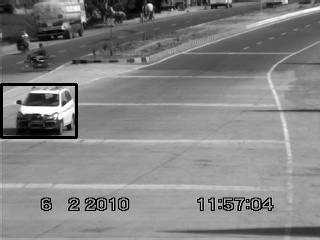
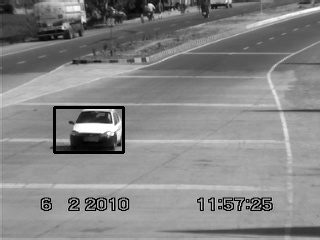
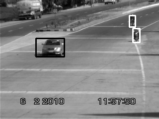
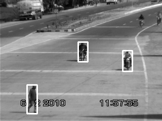
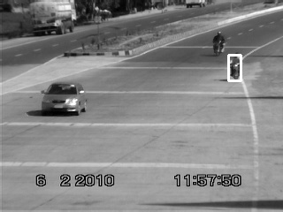
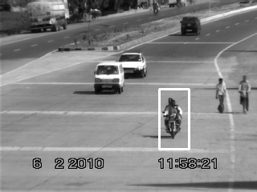
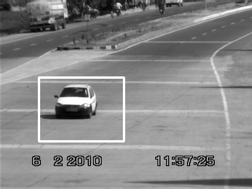
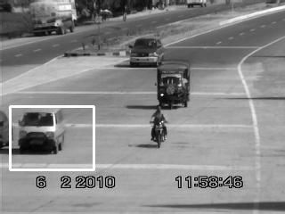

**Vehicle Detection and Classification**
=============================

A project by Tanmaya Dabral, Bhargav Kanuparthi and Sabrinath Harilal as a part of the Image Processing course (BITS F311) offered at BITS Pilani, Hyderabad Campus. The aim of the project was to detect and classify vehicles from a video of an Indian highway, the classification labels being "Heavy" and "Light". Both supervised and unsupervised approaches were tried.

Note: Since committing thousands of frames every time they are processed is a hassle, only zipped versions are committed.
*****

Method used
----------
The vehicle blobs were first obtained by subtracting the images from the median image followed by elementary cleaning operations. For the unsupervised approach, the blobs were clustered based on their area and their median width to median height ratio. For the supervised approach, a few high-precision low recall samples of both classes were obtained using blob statistics. Then, a Haar cascade classifier was trained for each class using these training examples.

*****

Results
---------
The unsupervised clustering performs reasonably well on both classes. However, the supervised approach gives far too many false negatives for the heavy class to be acceptable. The "Light" class however, is predicted with greater accuracy by the Haar cascade classifier.

**Clustering examples:**

    

    

**Haar cascades examples (Two-Wheelers):**

  

**Haar cascades examples (Four-Wheelers):**:

 

